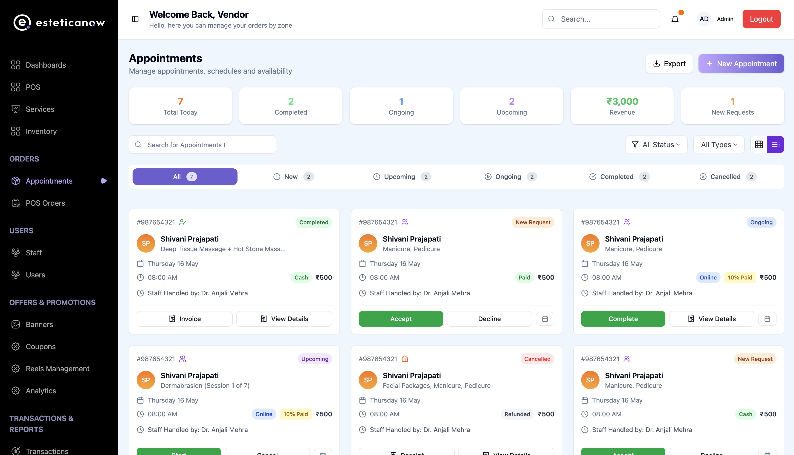
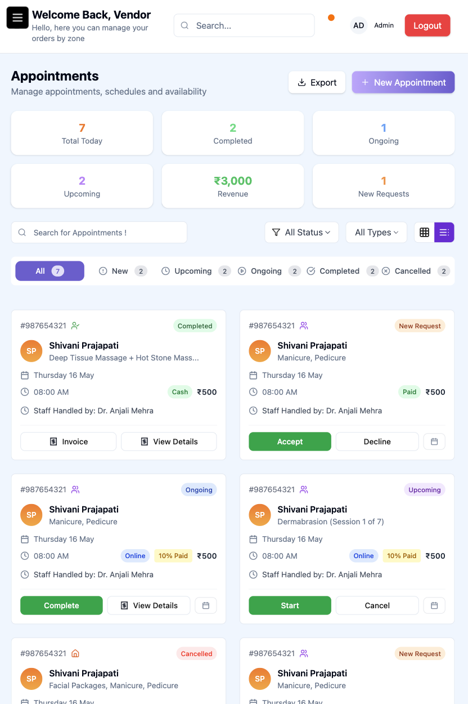
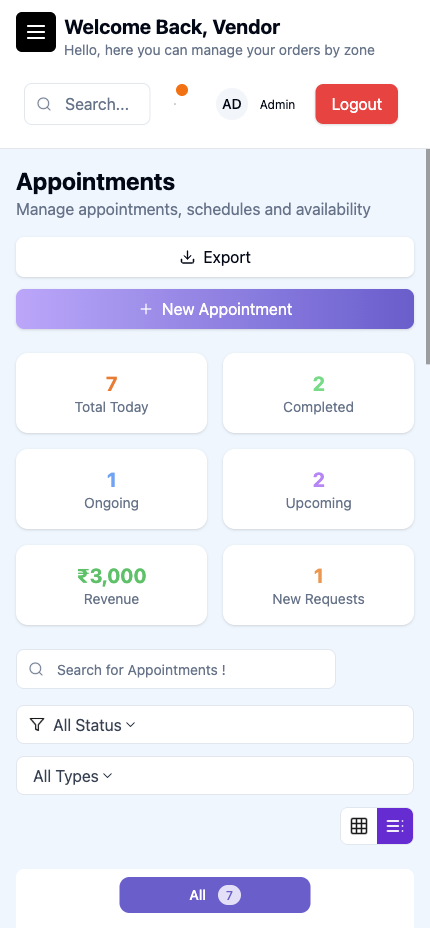

# Vite + React + TailwindCSS

A simple responsive web app built with Vite, React, TypeScript, and Tailwind CSS.
It works smoothly on mobile, tablet, and desktop screens.

---

## Features

- ⚡ **Fast Development** – Powered by Vite for instant HMR and optimized builds

- 🧩 **React + TypeScript** – Component-based architecture with type safety

- 🎨 **TailwindCSS Styling** – Clean, utility-first CSS for rapid UI development

- 📱 **Fully Responsive** – Smooth layouts for mobile, tablet, and desktop views

- 💡 **Reusable Components** – Modular and maintainable code structure

---

## Screenshots

Here’s a glimpse of the app in action 👇  

### Landing Page 

### Tab View
 

### Mobile View

## Run the project

- Clone it
- npm install (Node Version 20 => nvm use 20)
- npm run dev

